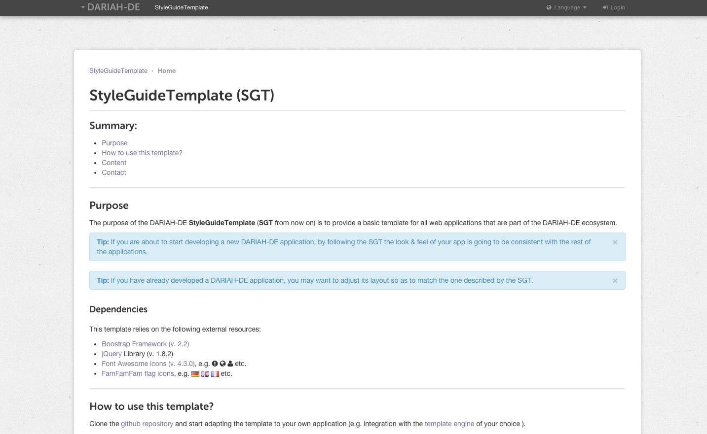

# DARIAH-DE Style Guide Template

* based on Patrick Heck's DARIAH-DE template (patrick@patrickheck.de)
* this template requires Bootstrap (2.2.2) and jQuery (1.8.2) 
* the goal is to facilitate the development of interfaces for web tools that are part of DARIAH-DE

## How to use this template?

1. `git clone` this repository
2. `cd` into the `templates` directory
3. launch a web server from terminal with `python -m SimpleHTTPServer 8000`
4. open `localhost:8000` in a browser

or just check it out at <http://dariah-de.github.io/StyleGuideTemplate/>

## Contact

This template was packaged together by [Matteo Romanello](https://github.com/mromanello) and is based on the layout design by [Patrick Heck](https://github.com/patrickheck).

For bugs, feature requests etc. please use the [github issue tracker](https://github.com/DARIAH-DE/StyleGuideTemplate/issues).
