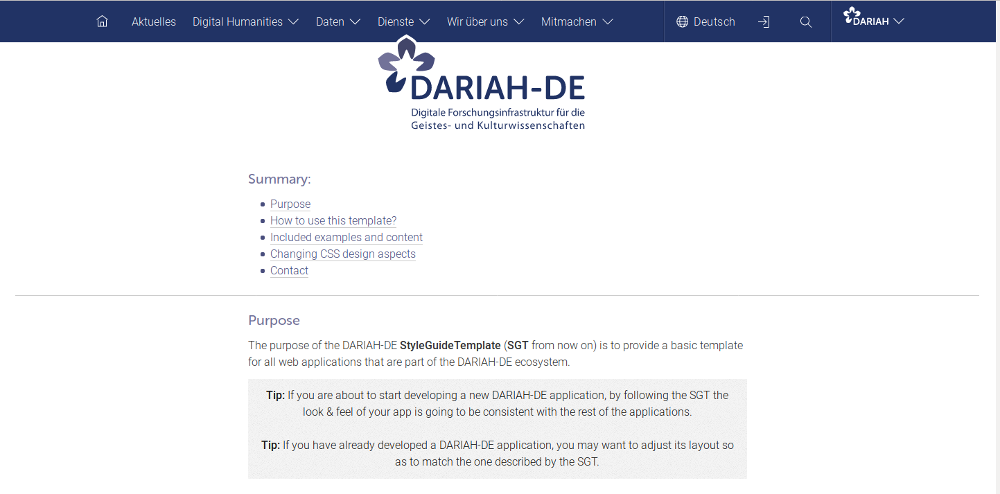

# DARIAH-DE Style Guide Template



The goal of this template is to facilitate the development of interfaces for web tools that are part of the DARIAH-DE ecosystem.

This template is based on the report [R. 1.2.2/R. 7.5 *Usability Criteria for External Requests of Collaboration*](https://wiki.de.dariah.eu/download/attachments/14651583/R1.2.2-7.5_final.pdf?version=1&modificationDate=1452850842838&api=v2), specifically the *DARIAH-DE Style Guide* contained in the Appendix.

## How to view this template?

1. `git clone` this repository
2. `cd` into the `templates` directory
3. launch a web server from terminal with `python -m SimpleHTTPServer 8000` (for python2) or `python3 -m http.server` (for python3)
4. open `localhost:8000` in a browser

or just check it out at <http://dariah-de.github.io/StyleGuideTemplate/>.

To view the previous style guide version, `cd` to `templates/StyleGuide_v100` and launch
the web server from that directory.

## Design Primer

For tips and guidelines on the extension of this template, have a look at
the [Design-Primer](design-primer.de.md) (currently only in German)

## Contact

This style guide was compiled by [Malte Vogl](https://github.com/maltevogl), Hanna Meiners and Klaus Thoden, based on a design by [Tobias Schäfer](https://github.com/tschaef).

This work is based on the previous template, which was packaged together by [Matteo Romanello](https://github.com/mromanello) and was based on the layout design by [Patrick Heck](https://github.com/patrickheck).

For bugs, feature requests etc. please use the [github issue tracker](https://github.com/DARIAH-DE/StyleGuideTemplate/issues).

## Global Menu

WORK IN PROGRESS

To ensure the global navigation menu remains consistent accross all services, make sure to use a minimal `ul` with `id="home_dropdown_menu"` as in the template and to include
```html
<script type="text/javascript" src="assets/globalmenu.js"></script>
```
which will load the central version.
